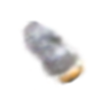

# Splatter Image - Supervise by desired splatter image
In this project we aim to enhance the splatter image rendering by introducing a new loss function that incorporates supervision from a Ground Truth splatter image. The new loss function is designed to improve learning by utilising weighting the loss by the opacity of Ground truth splatter image pixels. thereby guiding the model towards better predictions.
## Table of Contents:
- [Introduction](#Introduction)
- [New Loss Function](#new-loss-function)
  - [Target Splatter Image](#target-splatter-image)
  - [Normalization](#normalization)
  - [Loss Function](#loss-function)

- [Installation](#Installation)
- [Dataset](#Training)
- [Training](#Training)

- [Results](#Results)
  - [Table](#table)
  - [Image Visualisation](#Image-Visualisation)
  - [3D Visualisation](#3D-Visualisation)
    
- [Conclusions](#Conclusion)

## Introduction:
  Splatter image rendering is a technique used for high-quality image generation by modeling object surfaces with Gaussian splats. This project aims to introduce an enhancement to this method by utilizing a new loss function that compares predicted splatter images to a desired 'target' splatter image, thereby providing better supervision for training deep models. This supervised learning approach improve the quality of the generated images.
## New loss fucntion:
  The new loss function introduced in this project is designed to provide better supervision to the model by comparing the predicted splatter images to a GT or 'target' splatter image generated from one-view set. This loss function is a combination of multiple components, each designed to measure the differences between the predicted and target images for different channels (e.g., xyz, opacity).
### Target Splatter image:
  We created the target splatter image reconstrucntion by using only one view. The idea is to use it as ground truth reconstruction and to comapre it with the generated reconstruction of the model to improve the model performance.
### Normalization:
Before calculating the loss, the channels (e.g., xyz, scaling) from the predicted and target images are normalized using min-max normalization. This ensures that the values are within a consistent range between 0 and 1.

### Loss Function:
The custom loss function is defined as: 
Ltotal = Lbase &plus;  &lambda; &times; Lnew

&lambda;: is dynamically changed across training

Which new loss defined as: 
$\Sigma_{c &in; all\O} $
$mean$( Otarget(ccurrent &minus; ctarget)2)
- Which c represent channel in the current reconstruction of the model (e.g., xyz, opacity, rotation).
- O - opacity of the current reconstruction
- Otarget - represent the target opacity

The idea behind multiplying with target opacity is to ensure that only the more emphasised parts of the ground truth image contributes strongly to the loss.
## Installation: 
- follow the instructions on the original repository [Splatter Image Repository](https://github.com/szymanowiczs/splatter-image.git)
- To set your own Ground truth splatter images please go to train_network.py, search for the variable target_dataset and set the path to your GT-SI directory, make sure that it contains folders of the name of sample id and in each folder is the reconstruction with type .pt.
## Dataset:
- We used 20% of data from the SRNcars Datasets 
- Our target reconstruction are saved on the drive but also you can create them by uncomment the lines in eval.py in the section save target reconstruction and run the file.
- **NOTE: make sure that the dataset folder's name that you want to use during training is cars_train.**
- - **NOTE: To create Splatter image target to use during training, you should change the folder's name that contains the dataset to cars_test and run eval.py**
  
## Training:
- Both models were trained on T4(Google Colab)
- Both models were trained for 15,000 iterations.
- Used batch size is 4.
- cfg.data.input_images = 1.

## Results:
### Table:

Here are the reuslts of trainging the base and our model. As we can see our model outperformed the base model in LPIPS and SSIM metrics. but not in PSNR.
| Metric        | Base Model | Our Model  |
| ------------- | ---------- | ---------- |
| LPIPS_cond  ↓ | 0.12593    | 0.12692    |
| LPIPS_novel ↓ | 0.2434     | 0.21553    |
| SSIM_cond ↑   | 0.93443    | 0.93428    |
| SSIM_novel ↑  | 0.84434    | 0.8466     |
| PSNR_cond  ↑  | 26.15599   | 25.94715   |
| PSNR_novel ↑  | 19.97051   | 19.87617   |

### Image Visualisation:

| Pose No.    | Base Model | Our Model  | Ground Truth (GT) |
| ----------- | ---------- | ---------- | ----------------- |
| 1           |  |  |  |
| 2           |  |  |  |
| 3           |  |  |  |
| 4           |  |  |  |
| 5           |  |  |  |

### 3D Visualisation:

## Conclusions:
 Incorporating an additional loss during training shows that our model outperforms the base model in perceptual quality, as seen in the LPIPS and SSIM metrics. It generates images closer to the ground truth, with significant improvements in both conditional and novel settings. However, the base model performs better in PSNR, indicating slightly higher pixel-level accuracy.

